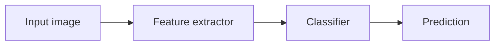

# wavachao.github.io

Wu Huachao 的个人主页与技术博客，使用 GitHub Pages、Jekyll 和 Markdown
维护。

日常更新不需要修改 HTML，也不需要手工维护博客目录：

- 写好一个 Markdown 文件；
- 放到 `_posts/`；
- 推送到 `master`；
- GitHub Pages 自动构建并同步首页、博客、归档、分类、标签与 RSS。

线上地址：<https://wavachao.github.io/>

## 1. 最简单的发文流程

### 方法一：直接使用 GitHub 网页

1. 打开本仓库的 `content/POST_TEMPLATE.md`。
2. 复制模板内容。
3. 在 `_posts/` 目录点击 **Add file → Create new file**。
4. 文件名填写：

   ```text
   YYYY-MM-DD-short-slug.md
   ```

   例如：

   ```text
   2026-07-26-training-free-segmentation.md
   ```

5. 粘贴模板，修改标题、日期、分类、标签和正文。
6. 点击 **Commit changes**，提交到 `master`。
7. 打开仓库的 **Actions** 页面，等待 `pages build and deployment`
   变为绿色。

通常等待几十秒后文章就会发布。

### 方法二：在本地写完后推送

```bash
cp content/POST_TEMPLATE.md _posts/2026-07-26-my-new-post.md
```

写完后：

```bash
git add _posts/2026-07-26-my-new-post.md
git commit -m "Add my new post"
git push origin master
```

## 2. 文章文件格式

每篇文章必须位于 `_posts/`，文件名必须以日期开头：

```text
_posts/YYYY-MM-DD-short-slug.md
```

文件顶部是 YAML Front Matter：

```yaml
---
layout: post
title: "Training-free Few-shot Segmentation Notes"
date: 2026-07-26 10:00:00 +0800
categories:
  - Computer Vision
tags:
  - segmentation
  - foundation-models
description: A concise summary used by search engines and article lists.
---
```

字段说明：

| 字段 | 是否必填 | 作用 |
| --- | --- | --- |
| `title` | 是 | 文章标题 |
| `date` | 是 | 发布时间；不要填写未来时间 |
| `categories` | 推荐 | 大类，通常设置 1–2 个 |
| `tags` | 推荐 | 更细的关键词，可设置多个 |
| `description` | 推荐 | 搜索引擎和列表使用的短摘要 |
| `layout` | 否 | `_posts/` 默认使用 `post`，模板保留它便于阅读 |
| `math` | 否 | 普通文章自动加载公式；其他独立页面需要公式时设为 `true` |

YAML 必须使用空格缩进，不能使用 Tab。包含冒号或特殊符号的标题建议加引号。

## 3. 发布后哪些页面会自动更新

新 Markdown 文章提交后，不需要再修改任何列表：

| 页面 | 自动更新内容 |
| --- | --- |
| `/` | Writing 区域、文章总数和年份范围 |
| `/blog/` | Latest note、Latest entries 和主题入口 |
| `/archives/` | 时间线、文章总数和搜索数据 |
| `/categories/` | 分类及合并后的新旧文章数量 |
| `/tags/` | 标签及合并后的新旧文章数量 |
| `/atom.xml` | 最新文章 RSS/Atom Feed |

文章永久链接格式为：

```text
/blog/YYYY/MM/DD/short-slug/
```

## 4. Markdown 支持

站点使用 kramdown 的 GFM 模式，支持标准 Markdown 和常见技术写作扩展。

### 标题、强调和删除线

```markdown
# 一级标题
## 二级标题
### 三级标题

**粗体**
*斜体*
~~删除线~~
`inline code`
```

文章标题已经由 Front Matter 生成，正文通常从 `##` 开始。

### 列表与任务列表

```markdown
- 无序列表
- 第二项
  - 嵌套项目

1. 有序列表
2. 第二项

- [x] 已完成
- [ ] 待完成
```

### 引用

```markdown
> A useful observation.
>
> 引用中可以包含多个段落。
```

### 链接与图片

```markdown
[GitHub](https://github.com/wavachao)


```

每张图片都应填写有意义的替代文字，不要只写 `image`。

### 代码块与高亮

在开头的三个反引号后填写语言：

````markdown
```cpp
#include <iostream>

int main() {
    std::cout << "Hello" << std::endl;
}
```
````

常用语言标记包括 `cpp`、`c`、`go`、`python`、`bash`、`yaml`、`json`
和 `text`。代码块由 Rouge 自动高亮，长代码可以横向滚动。

### 表格

```markdown
| Model | mIoU | FPS |
| --- | ---: | ---: |
| Baseline | 62.4 | 35 |
| Ours | 68.1 | 31 |
```

宽表格在手机上会自动横向滚动，不会撑破页面。

### 脚注

```markdown
This result follows the official protocol.[^protocol]

[^protocol]: Describe the protocol or provide the reference here.
```

### 折叠内容

Markdown 中可以直接使用安全的 HTML：

```html
<details>
  <summary>展开实验配置</summary>

  Batch size: 8<br>
  Learning rate: 1e-4
</details>
```

### 键盘按键与高亮

```html
Press <kbd>Ctrl</kbd> + <kbd>F5</kbd>.

This is <mark>important</mark>.
```

## 5. LaTeX 数学公式

博客文章会自动加载 MathJax 4，不需要在每篇文章里添加脚本。

### 行内公式

推荐写法：

```markdown
The posterior is $p(y \mid x)$.
```

也支持：

```markdown
The posterior is \(p(y \mid x)\).
```

### 块级公式

```markdown
$$
\mathcal{L}_{\mathrm{CE}}
= -\sum_{c=1}^{C} y_c \log p_c
$$
```

也支持：

```markdown
\[
\hat{y} = \arg\max_c p(c \mid x)
\]
```

AMS 环境和自动编号可以直接使用：

```markdown
$$
\begin{aligned}
\mu_c &= \frac{1}{N_c}\sum_{i:y_i=c} x_i, \\
\Sigma_c &= \frac{1}{N_c-1}\sum_{i:y_i=c}(x_i-\mu_c)(x_i-\mu_c)^\top.
\end{aligned}
$$
```

如果正文需要显示普通美元符号，请写成 `\$`，避免被识别成公式分隔符。

不要把公式放进代码块；代码块中的 LaTeX 会按原文显示。

## 6. Mermaid 图表

使用 `mermaid` 代码块即可自动渲染，不需要额外 Front Matter：

````markdown

````

也支持 sequence diagram、class diagram、state diagram、ER diagram、Git graph
等 Mermaid 11 语法。

如果 CDN 临时不可用，页面会保留原始 Mermaid 文本，不会丢失内容。

## 7. 添加博客图片

图床仓库：

```text
git@github.com:wavachao/blog-img.git
```

推荐目录结构：

```text
blog-img/
└── 2026/
    └── article-slug/
        ├── overview.png
        └── result-table.png
```

上传图片：

```bash
git clone git@github.com:wavachao/blog-img.git
cd blog-img
git add 2026/article-slug/overview.png
git commit -m "Add images for article-slug"
git push origin main
```

在 Markdown 中引用：

```markdown

```

注意：

- GitHub Raw URL 中的分支名通常是 `main`；
- 文件名尽量使用英文、数字和连字符；
- 不要覆盖已经被旧文章引用的同名图片；
- 大图建议先压缩，避免首页和文章加载过慢。

## 8. 修改主页

主页中经常修改的内容集中在：

```text
_data/profile.yml
```

可以修改：

- 姓名、职业、地点和 Focus；
- Hero 介绍；
- Current direction；
- About 文案；
- 研究、后端和系统方向；
- Selected work 项目卡片；
- GitHub、Blog 和 RSS 链接。

项目卡片格式：

```yaml
projects:
  - type: Research · Computer Vision
    title: Project Name
    description: >-
      A concise, evidence-based description.
    stack: Python · PyTorch · Segmentation
    url: https://github.com/wavachao/project-name
```

注意 YAML 缩进。只修改文案时，不需要改 `index.html` 或 CSS。

## 9. 本地预览

安装 Ruby 和 Bundler 后，在仓库根目录执行：

```bash
bundle install
bundle exec jekyll serve
```

打开：

```text
http://127.0.0.1:4000
```

需要让局域网其他设备访问时：

```bash
bundle exec jekyll serve --host 0.0.0.0
```

如果只通过 GitHub 网页发文，可以跳过本地预览，直接查看 Actions 构建结果。

## 10. 发布前检查

每次发布文章建议确认：

- [ ] 文件位于 `_posts/`
- [ ] 文件名是 `YYYY-MM-DD-short-slug.md`
- [ ] Front Matter 的 `date` 不是未来时间
- [ ] YAML 使用空格缩进
- [ ] 标题和描述已经修改
- [ ] 分类和标签不是模板占位内容
- [ ] 代码块填写了语言
- [ ] 图片 URL 可以直接打开
- [ ] 图片有替代文字
- [ ] 公式分隔符成对闭合
- [ ] Actions 中 Pages 构建成功
- [ ] 桌面和手机各检查一次

## 11. 常见问题

### 推送后文章没有出现

依次检查：

1. 文件是否位于 `_posts/`；
2. 文件名日期格式是否正确；
3. Front Matter 是否以两行 `---` 包围；
4. `date` 是否填写了未来日期；
5. GitHub Actions 是否构建失败；
6. 是否需要使用 `Ctrl + F5` 清理浏览器缓存。

### GitHub Actions 报 YAML 错误

最常见原因是缩进、Tab、未闭合引号或标题中的冒号。将字符串放进引号并检查
Front Matter。

### 公式显示为原始文本

检查：

- 文章是否使用 `post` layout；
- `$`、`$$`、`\(`、`\[` 是否成对；
- 公式是否误放在代码块中；
- 浏览器是否拦截了 `cdn.jsdelivr.net`。

### Mermaid 没有渲染

确认代码块语言写的是小写 `mermaid`，并检查图表语法。CDN 不可用时会显示原始
文本，稍后刷新即可。

## 12. 项目结构

```text
_data/profile.yml       主页可编辑内容
_posts/                 新 Markdown 文章
content/POST_TEMPLATE.md 新文章模板
_layouts/               页面与文章布局
_includes/              顶部导航和页脚
assets/css/site.css     全站视觉样式
assets/js/site.js       主题、归档搜索、Mermaid 等交互
blog/                   博客主页
archives/               完整时间线与搜索
categories/             分类索引
tags/                   标签索引
atom.xml                自动生成的 Atom Feed
```

## 13. 旧文章

132 篇 Hexo 旧文章保留原始 URL，正文继续使用当前统一文章布局。

- 旧文章元数据：`_data/legacy_posts.yml`
- 旧分类和标签：`_data/legacy_topics.yml`
- 旧文章图片：`wavachao/blog-img`
- 原始图片来源映射：`blog-img/legacy/sources.json`

一般发新文章时不要修改旧文章数据文件。

迁移脚本仅在维护旧内容时使用：

```bash
python3 scripts/extract_legacy_posts.py
python3 scripts/migrate_legacy_articles.py
python3 scripts/migrate_image_urls.py
```
