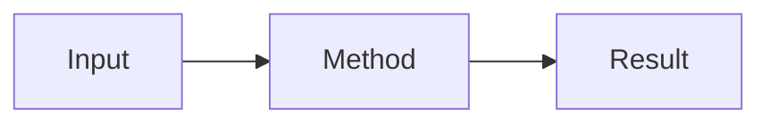

Write a short introduction: the problem, why it matters, and what this note
contains.

## Problem and context

Explain the setup and assumptions. Inline LaTeX works with
$p(y \mid x)$, and display equations use double dollar signs:

$$
\mathcal{L} = -\sum_{c=1}^{C} y_c \log p_c
$$

## Method or implementation

Use fenced code blocks with a language name for syntax highlighting.

```cpp
#include <iostream>

int main() {
    std::cout << "Hello, notes." << std::endl;
}
```

Images can use the GitHub image repository:

```markdown

```

Tables, task lists, footnotes, raw HTML details, and Mermaid diagrams are also
supported. Delete this optional diagram if it is not needed:



## Results and discussion

State the result, evidence, limitations, and any unresolved questions.

## Conclusion

Summarize the result, limitations, and the next useful question.

<!--
Publishing checklist:
1. Filename: _posts/YYYY-MM-DD-short-slug.md
2. The front-matter date is not in the future.
3. YAML indentation uses spaces, not tabs.
4. Every image has useful alt text.
5. Push to the master branch and wait for the Pages workflow to succeed.
-->
